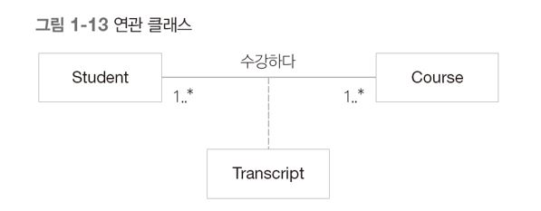

다중성
---

다중성은 관계를 표시하기 위한 규칙이다.

다음과 같은 규칙을 따라 관계를 표시한다.

따라서 다음과 같은 경우에는

학생은 한명의 교수에게 상담하며,

교수는 한명 이상의 학생을 상담할 수 있다는 뜻이다.

양방향 연관 관계
---

- 두 클래스를 연결한 선에 화살표를 사용하지 않는다.
- 서로의 존재를 인지해야 한다.

단방향 연관관계
---

- 한쪽은 상대를 알지만 다른쪽은 존재를 몰라야 한다.

다음과 같은 관계를 코드로 나타내면 이와 같을것이다.

~~~
     private class Student
        {
            private List <Course> cs = null;

            public void registerCoures(Course coures)
            {
                cs.Add(coures);
            }

            public void dropCoures(Course coures)
            {
                cs.Remove(coures);
            }
        }

        public class Course
        {

        }
~~~

Q. 체크포인트
---

다음과 같은 클래스 다이어그램을 제작하라.

 - 학생은 반드시 한 학교에 소속되어야 한다.
 
 - 학교에는 학생이 반드시 100명이상 소속되어 있어야 한다.
 
 
 **정답**
 
 학생------등록-------학교
    100..*        1
     
     

연관 클래스
---

연관 관계에 추가할 속성이나 행위가 있을 때 사용한다.

예시

> Ex> 이정환은 소공에서 A+를 받았따..  
> 이정환 : Student, 소공 : Coures, A+ : TranScript

다만 c#에는 다음과 같은 연관클래스 기능을 제공하지 않는다. 고로 다음과 같이 다이어그램을 변경하여 사용한다.

